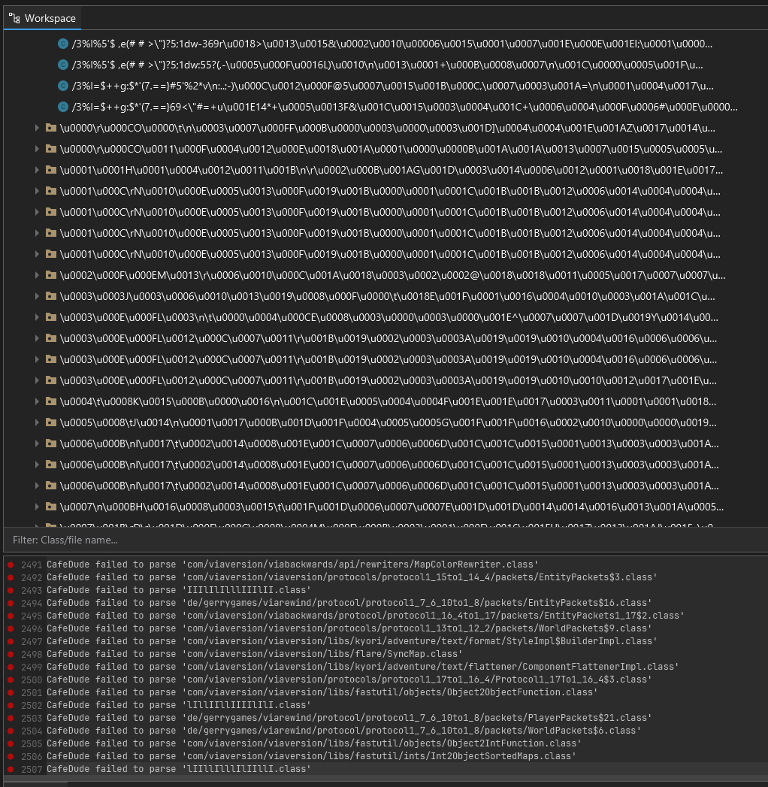
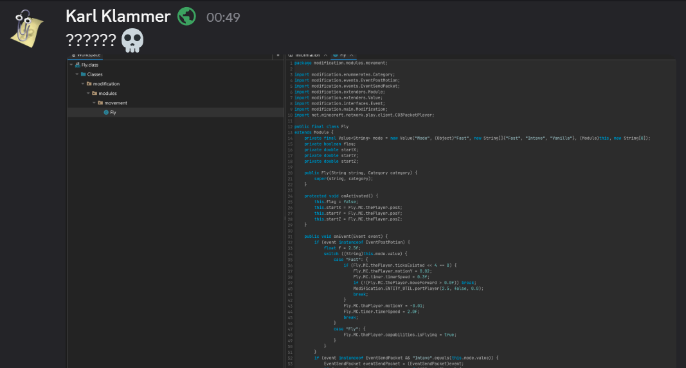
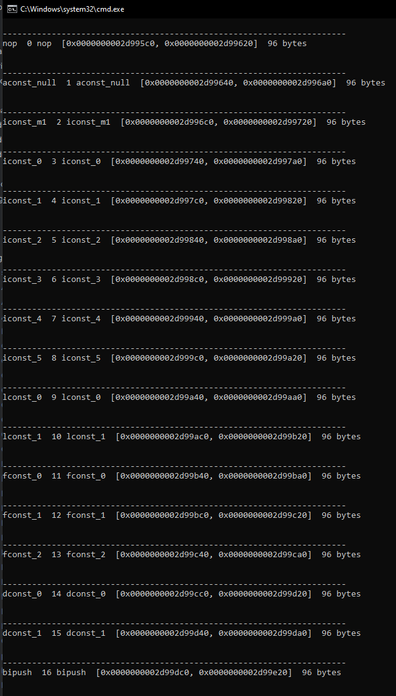
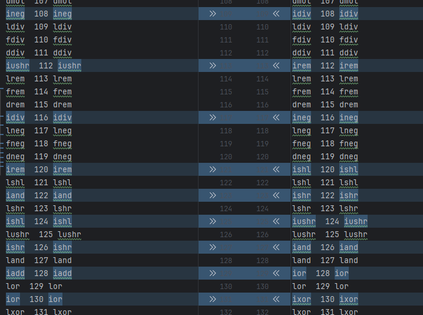
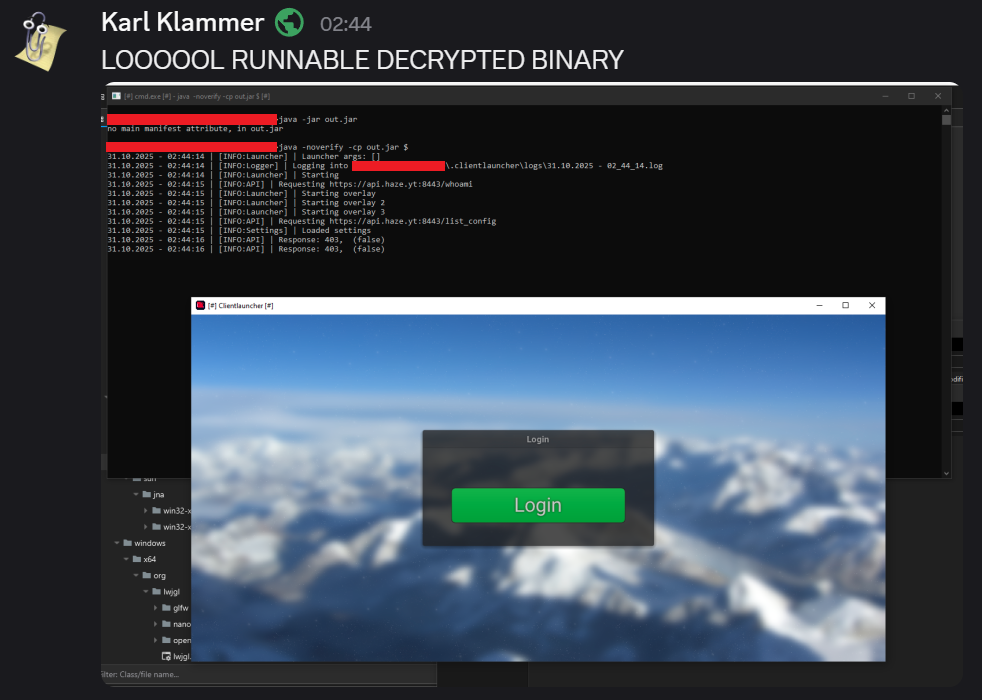

# Defeating Buddy's insane jdk security
###### ("Buddy" made most of the protection found in Clientlauncher)

---

As one might know, [Clientlauncher](https://clientlauncher.net) uses a "custom" JDK, which seemingly encrypts classes because dragging the `client.exe` (which in reality is just a renamed jar file) into recaf turns out to be total garbage!



## Obfuscation!!

At first, I thought something along the lines of "Hmm, this is some interesting obfuscation", however after asking a friend of mine, he told me that the class file is indeed invalid! (as you might have guessed, because recaf told you)

## Not-So-Custom Java Runtime

Let's just say, it didn't take long for me to realize that the "custom" jdk used is a _slightly_ modified version of openjdk, not telling which one yet, but all you need to know is that it's openjdk with some light tweaks as you may be able to see when running `java -version`

```
openjdk version "1.8.0_252"
OpenJDK Runtime Environment (build 1.8.0_252-b09)
OpenJDK 64-Bit Server VM (build 25.252-b09, mixed mode)
```

Not too special after all, huh?

That said, you still can't run custom apps with it, because it's still trying to decrypt the classes, which gives us our first hint! (thanks to whoever added that error message)

```
*clientlauncher jdk folder*\bin>.\java.exe -jar ..\..\recaf.jar
:CL:A:file:/*path to recaf jar*
Error: A JNI error has occurred, please check your installation and try again
Exception in thread "main" java.lang.ClassFormatError: Illegal UTF8 string in constant pool in class file software/coley/recaf/launcher/LauncherGui
        at java.lang.ClassLoader.defineClass1(Native Method)
        at java.lang.ClassLoader.defineClass(Unknown Source)
        at java.security.SecureClassLoader.defineClass(Unknown Source)
        at java.net.URLClassLoader.defineClass(Unknown Source)
        at java.net.URLClassLoader.access$100(Unknown Source)
        at java.net.URLClassLoader$1.run(Unknown Source)
        at java.net.URLClassLoader$1.run(Unknown Source)
        at java.security.AccessController.doPrivileged(Native Method)
        at java.net.URLClassLoader.findClass(Unknown Source)
        at java.lang.ClassLoader.loadClass(Unknown Source)
        at sun.misc.Launcher$AppClassLoader.loadClass(Unknown Source)
        at java.lang.ClassLoader.loadClass(Unknown Source)
        at sun.launcher.LauncherHelper.checkAndLoadMain(Unknown Source)
```

## Illegal UTF8 string

... what?

Well, since it's based off openjdk, the first thing we are going to do is ~~look inside the [openjdk 8 source code](https://github.com/openjdk/jdk8u)~~ try to reverse engineer the JVM, because why not.

Soooo, a quick IDA string search told me that the string `Illegal UTF8 string in constant pool in class file` basically has 1 usage, inside the entire `jvm.dll`, the function is called `verify_legal_utf8`. Keep that in mind, we're going to need that in a second or two.

After which I came up with a brilliant idea: Compare the original jdk with it's modified counterpart!

(Didn't make as much progress, who would have thought)

## "Copy my test answers, but don't make it obvious"

In the end, I just renamed functions and variables in both the original jvm.dll and Clientlauncher's jvm.dll, including some functions referencing it. Not much to say here, however this took me an awful amount of time to get right, because IDA decided that it wanted to die halfway through and crashed on me...

At some point however, I ended up at [this line](https://github.com/openjdk/jdk8u/blob/d5ac2ad89a369697a48e7f3e6b889e22afa50a2f/hotspot/src/share/vm/classfile/classFileParser.cpp#L273) right here.

And guess what, it had a call to `verify_legal_utf8` right above it. So not only did we have a call to `verify_legal_utf8`, we had a searchable string to track it! (my IDA skills are fairly mediocre, I need them strings lol)

We don't have to care about the string at all tho. All that matters is the call to the function that got us the error message.

```c++
cfs->guarantee_more(2, CHECK);  // utf8_length
u2  utf8_length = cfs->get_u2_fast();
u1* utf8_buffer = cfs->get_u1_buffer();
assert(utf8_buffer != NULL, "null utf8 buffer");
// Got utf8 string, guarantee utf8_length+1 bytes, set stream position forward.
cfs->guarantee_more(utf8_length+1, CHECK);  // utf8 string, tag/access_flags
cfs->skip_u1_fast(utf8_length);

// Before storing the symbol, make sure it's legal
if (_need_verify) {
    verify_legal_utf8((unsigned char*)utf8_buffer, utf8_length, CHECK);
}
```
###### (taken directly from the source code)

## So what?

This is the part where it gets the UTF8 strings bytes, and verifies them. Shouldn't be too interesting, right?

Or so I thought...

Because after trying to get this to look as similar to source code as possible, I realized something.

```c++
if ( (unsigned __int64)(v7 - (_QWORD)cfs) < 2 )// guarantee_more(2, CHECK)
{
    truncated_file_error((__int64)&v81, CHECK);
    cfs = unsigned_utf8_buffer;
    v7 = v82;
}
if ( *(_QWORD *)(CHECK + 8) )
    return;
v46 = *cfs;
temp_utf8_buffer = (const char *)(cfs + 1);
unsigned_utf8_buffer = (unsigned __int16 *)temp_utf8_buffer;
utf8_length = _byteswap_ushort(v46);  // cfs->get_u2_fast()
utf8_buffer = temp_utf8_buffer;       // cfs->get_u1_buffer()
if ( (unsigned int)utf8_length + 1 > (unsigned __int64)(v7 - (_QWORD)temp_utf8_buffer) )// guarantee_more(utf8_length+1, CHECK)
{
    truncated_file_error((__int64)&v81, CHECK);
    temp_utf8_buffer = (const char *)unsigned_utf8_buffer;
}
if ( *(_QWORD *)(CHECK + 8) )
    return;
_need_verify = *(_BYTE *)a1 == 0;
unsigned_utf8_buffer = (unsigned __int16 *)&temp_utf8_buffer[utf8_length];// cfs->skip_u1_fast(utf8_length)
if ( !_need_verify )                  // inverted because bad decompiler
{
    verify_legal_utf8(a1, (__int64)utf8_buffer, utf8_length, CHECK);
    if ( *(_QWORD *)(CHECK + 8) )
        return;
}
```
###### (IDA decompiler output of the _original_ `jvm.dll`, with some renaming and comments to make it easier to understand/cross-reference)

This looks like ordinary decompiler output. Nothing too special, just a little unorganized because the compiler removed quite a lot of information to work with

However then I mirrored the same variable names to the Clientlauncher instance of IDA.

```c++
if ( (unsigned __int64)(v7 - (_QWORD)cfs) < 2 )// // guarantee_more(2, CHECK)
{
    truncated_file_error((__int64)&v83, CHECK);
    cfs = unsigned_utf8_buffer;
    v7 = v84;
}
if ( *(_QWORD *)(CHECK + 8) )
    return;
v46 = *cfs;
temp_utf8_buffer = (const char *)(cfs + 1);
haze_decrypt_idx = 0;                 // not in original
unsigned_utf8_buffer = (unsigned __int16 *)temp_utf8_buffer;
utf8_buffer = temp_utf8_buffer;       // cfs->get_u1_buffer()
utf8_length = _byteswap_ushort(v46);  // cfs->get_u2_fast()
if ( utf8_length )                    // what the fuck
{
    do
    {
        ++temp_utf8_buffer;
        haze_temp_var = haze_decrypt_idx++ ^ utf8_length;
        *((_BYTE *)temp_utf8_buffer - 1) ^= haze_temp_var;
    }
    while ( haze_decrypt_idx < utf8_length );
    temp_utf8_buffer = (const char *)unsigned_utf8_buffer;
    v7 = v84;
}
if ( (unsigned int)utf8_length + 1 > (unsigned __int64)(v7 - (_QWORD)temp_utf8_buffer) )// guarantee_more(utf8_length+1, CHECK)
{
    truncated_file_error((__int64)&v83, CHECK);
    temp_utf8_buffer = (const char *)unsigned_utf8_buffer;
}
if ( *(_QWORD *)(CHECK + 8) )
    return;
_need_verify = *(_BYTE *)a1 == 0;
unsigned_utf8_buffer = (unsigned __int16 *)&temp_utf8_buffer[utf8_length];// // cfs->skip_u1_fast(utf8_length)
if ( !_need_verify )                  // inverted because bad decompiler
{
    verify_legal_utf8(a1, (__int64)utf8_buffer, utf8_length, CHECK);
    if ( *(_QWORD *)(CHECK + 8) )
        return;
}
```
###### (IDA decompiler output of the _modified_ `jvm.dll`, with some renaming and comments to make it easier to understand/cross-reference)

## WOAH

As I marked with the rather fitting comment, there was an unusual amount of extra code just lying around!

```c++
if ( utf8_length )                    // what the fuck
{
    do
    {
        ++temp_utf8_buffer;
        haze_temp_var = haze_decrypt_idx++ ^ utf8_length;
        *((_BYTE *)temp_utf8_buffer - 1) ^= haze_temp_var;
    }
    while ( haze_decrypt_idx < utf8_length );
    temp_utf8_buffer = (const char *)unsigned_utf8_buffer;
    v7 = v84;
}
```

###### (Part of the decompiler output of the _modified_ `jvm.dll`)

I know that the renamed variables kind of spoil it, but that is a crazy find! A simple, keyless XOR, just lying around, obviously running **over the UTF8 string!**

This had to be tested, and I did. By just slapping the modified UTF8 handling [into ObjectWeb ASM](src/main/java/org/objectweb/asm/ClassReader.java) (line 3778)

Speaking of that, I called this project "HasenASM", because it's a modified version of ASM, and the word "Haze" (name of the owner of Clientlauncher) kinda looks like "Hase", the german word for bunny (I like bunnies)

Anyway, yeah it worked.



## See anything weird?

If yes, damn you're good.

Well... Math operations seem a little _odd_, and that's not a coincidence or bad code.

`if (Fly.MC.thePlayer.tickExisted << 4 == 0) ...` (in this example) might just be badly written code, however in other classes, there was full on invalid code because the replaces opcodes broke the stack at some points.

## Where do we get the bytecode handling code inside the jdk?

As it turns out, we don't have to!

According to the [OpenJDK Wiki](https://wiki.openjdk.org/display/HotSpot/PrintAssembly) we can just run `java.exe -XX:+UnlockDiagnosticVMOptions -XX:+PrintInterpreter` and get a LOT of debug information to work with!



###### (The JVM printing all instructions along with their opcodes)

After quite a lot of cleanup with regex, I got [the original opcodes](docs/opcodes/opcodes_orig) and [clientlaunchers opcodes](docs/opcodes/opcodes_haze)

After running a diff on them (on IntelliJ, you can select both files and press Ctrl+D), I found some differences:



For some reason, it was only integer math instructions. But still, this is big!

[This is the full opcode map](docs/opcodes/opcode_map)

A quick switch replacing opcodes while reading the methods them fixed it, nothing too special.

## That's it?

Yep. After doing everything I explained in here, I got the Clientlauncher itself fully running on a vanilla OpenJDK build!



(ignore the messed up window icon, I messed around with the files lol)
